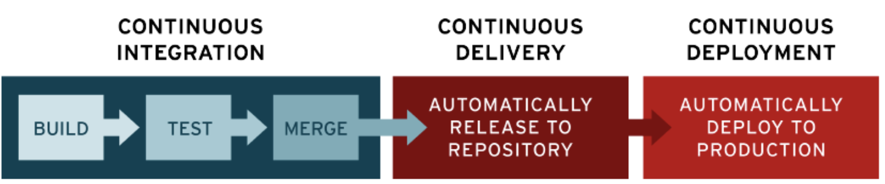
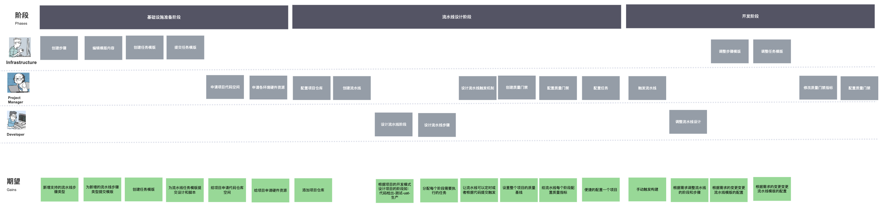

### 持续集成/持续部署（CICD）

持续交付部分包括持续集成（continuous integration，CI）和持续部署（continuous delivery，CD） 

持续集成是一种[软件工程](https://zh.wikipedia.org/wiki/軟體工程)流程，是将所有[软件工程师](https://zh.wikipedia.org/wiki/軟件工程師)对于软件的工作副本持续集成到共享主线（mainline）的一种举措。该名称最早由[[1\]](https://zh.wikipedia.org/wiki/持續整合#cite_note-1)[葛来迪·布区](https://zh.wikipedia.org/wiki/葛來迪·布區)（Grady Booch）在他的布区方法中提出，在[测试驱动开发](https://zh.wikipedia.org/wiki/测试驱动开发)（TDD）的作法中，通常还会搭配自动[单元测试](https://zh.wikipedia.org/wiki/单元测试)。持续集成的提出主要是为解决软件进行[系统集成](https://zh.wikipedia.org/wiki/系統整合)时面临的各项问题，[极限编程](https://zh.wikipedia.org/wiki/极限编程)称这些问题为集成地狱（integration hell）。

持续部署是一种[软件工程](https://zh.wikipedia.org/wiki/軟體工程)方法，意指在[软件开发流程](https://zh.wikipedia.org/wiki/軟體開發流程)中，以自动化方式，频繁而且持续性的，将[软件](https://zh.wikipedia.org/wiki/軟體)[部署](https://zh.wikipedia.org/wiki/软件部署)到生产环境（production environment）中，使软件产品能够快速的发展

在DevOps平台中，持续部署还集成了质量管理功能，利用PMD、Sonar等工具进行基础的代码检查，可以在一定程度上保证交付质量。

DevOps平台该部分的[用户旅程]( https://www.beeart.com/invitation?invitationCode=66d7eb41-1b6c-4d32-a864-0b69ecfde08b&tool=2f2d6f0a-9805-41e4-8221-aaf10516f667)如下：

### 主要场景

CICD部分主要包括以下几个业务场景：

#### 基础设施准备阶段

在基础设施准备阶段，