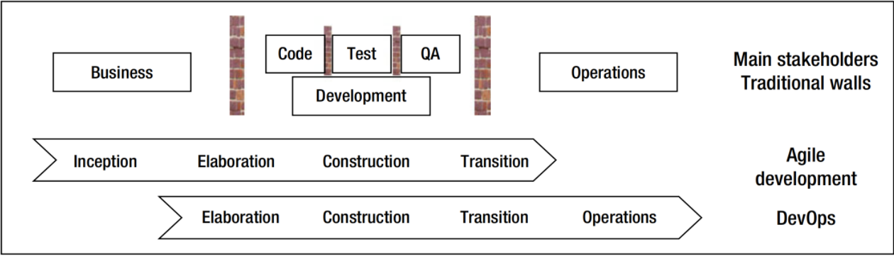
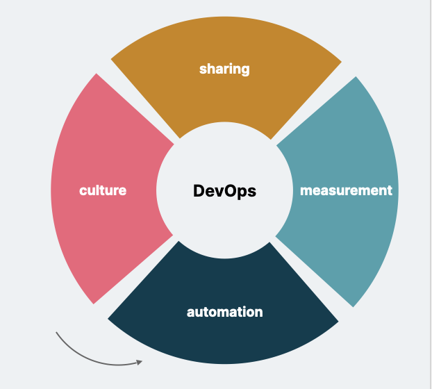
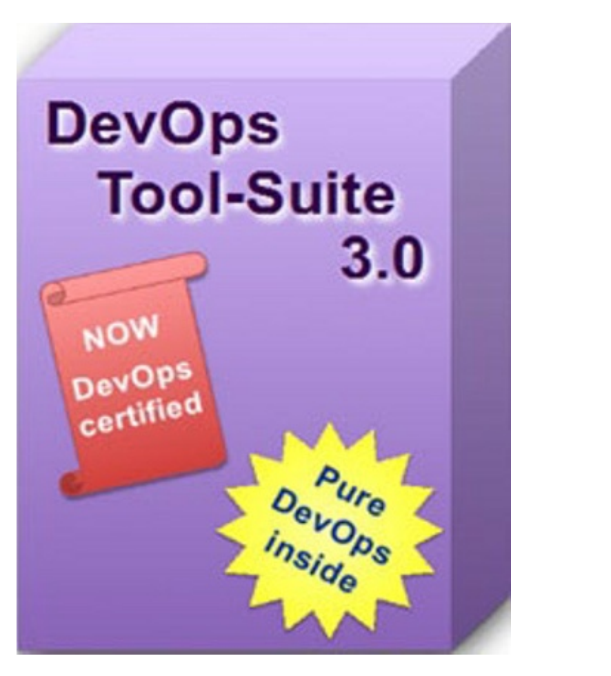
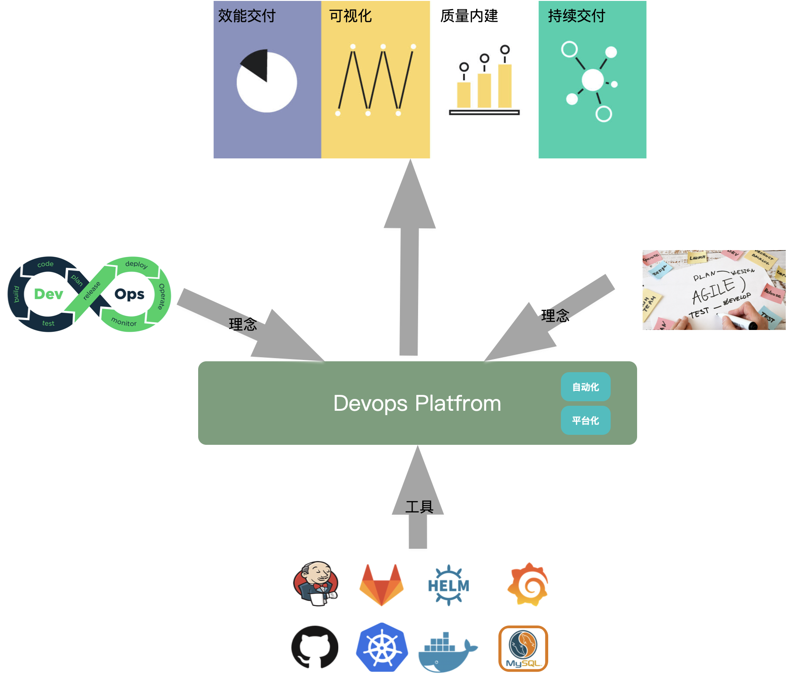

# Devops 平台-背景知识导入

### Devops

DevOps 本质上是通过对开发和运营都有意义的整体方法获得快速反馈和降低发布风险。实现一方法的一个主要步骤是改善功能从初始到可用性的流程。

DevOps 是一种交付方式的变革，有四个关键方面：

文化、自动化、度量和共享https://www.chef.io/blog/what-devops-means-to-me，其中，自动化是DevOps的重要组成部分，资源管理，配置，配置管理，系统集成，监视和控制以及编排的工具成为构建DevOps的重要组成部分。往往大家都直接使用开源的Devops工具，并且聘用相应的基础设施自动化专家进行DevOps转型，但往往会会遇到以下困难：

1. 基础设施自动化专家市面上比较难找，拼凑有基础设施专家的全功能团队较难
2. 由于过于庞杂的开源工具的知识，导致基础设施自动化专家与开发团队仍然是隔离状态，不能促进打破Operations 和交付团队之间的墙
3. 数据孤岛，不同的开源工具有不同的数据存储，甚至有些关键的数据没有持久化，导致要综合不同的工具对项目进行**度量** 时，遇到一些困难

因此为了更好的辅助DevOps转型，DevOps平台应运而生。

### DevOps平台

Devops平台是一个依托流行的Devops 工具，如Jenkins、Git lab、Kubernetes等进行一定组织，注入Devops 转型和敏捷转型的理念，从而促进效能交付的一款产品。

