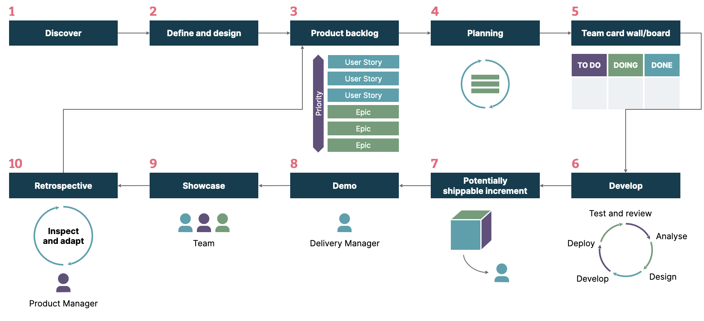
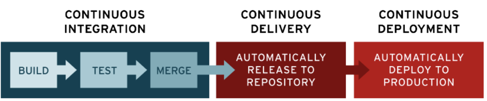
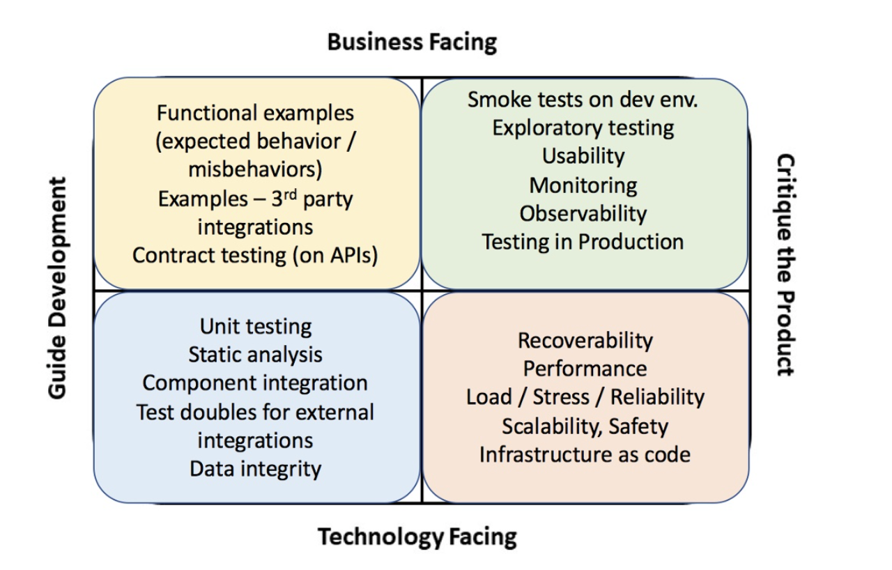
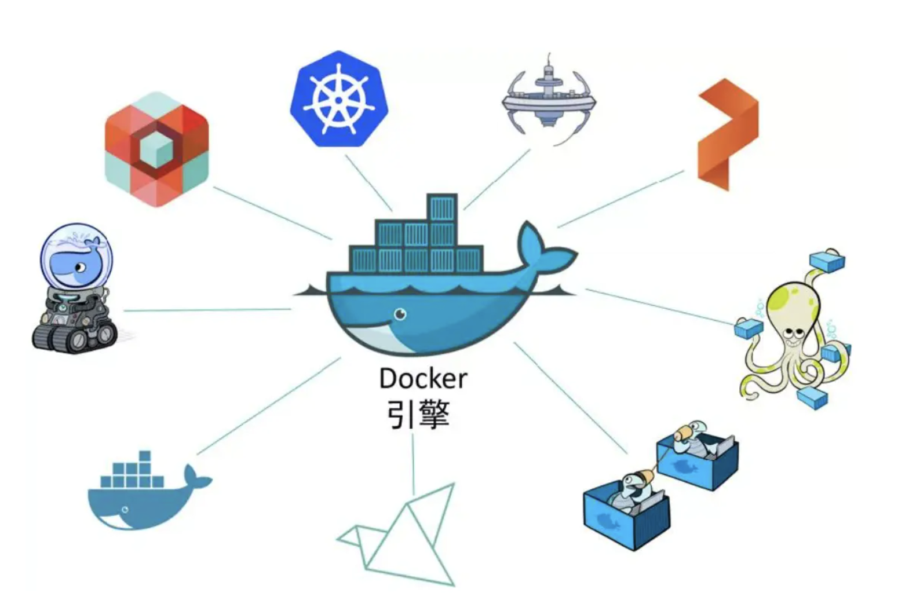

## 业务介绍

DevOps平台整体划分为几个部分：

1. 敏捷项目管理

2. 持续交付

3. 效能管理
4. 测试平台
5. 资源管理
6. 监控平台

### 敏捷项目管理

敏捷项目管理主要是从需求产生的想法阶段一直到完全交付的过程，目前业界成熟的产品如Jira等，包含敏捷项目管理的全部周期。

### 持续集成/持续部署（CICD）

持续交付部分包括持续集成（continuous integration，CI）和持续部署（continuous delivery，CD） 

持续集成是一种[软件工程](https://zh.wikipedia.org/wiki/軟體工程)流程，是将所有[软件工程师](https://zh.wikipedia.org/wiki/軟件工程師)对于软件的工作副本持续集成到共享主线（mainline）的一种举措。该名称最早由[[1\]](https://zh.wikipedia.org/wiki/持續整合#cite_note-1)[葛来迪·布区](https://zh.wikipedia.org/wiki/葛來迪·布區)（Grady Booch）在他的布区方法中提出，在[测试驱动开发](https://zh.wikipedia.org/wiki/测试驱动开发)（TDD）的作法中，通常还会搭配自动[单元测试](https://zh.wikipedia.org/wiki/单元测试)。持续集成的提出主要是为解决软件进行[系统集成](https://zh.wikipedia.org/wiki/系統整合)时面临的各项问题，[极限编程](https://zh.wikipedia.org/wiki/极限编程)称这些问题为集成地狱（integration hell）。

持续部署是一种[软件工程](https://zh.wikipedia.org/wiki/軟體工程)方法，意指在[软件开发流程](https://zh.wikipedia.org/wiki/軟體開發流程)中，以自动化方式，频繁而且持续性的，将[软件](https://zh.wikipedia.org/wiki/軟體)[部署](https://zh.wikipedia.org/wiki/软件部署)到生产环境（production environment）中，使软件产品能够快速的发展

在DevOps平台中，持续部署还集成了质量管理功能，利用PMD、Sonar等工具进行基础的代码检查，可以在一定程度上保证交付质量。

### 效能管理

度量和自动化都是Devops四大关键方面之一，因此DevOps平台需要对整个研发过程进行度量的自动化。采用一些常用的指标去度量研发效能，从而缩短反馈周期，有助于对交付流程的进一步优化。

分别从项目管理、代码提交、构建、部署、代码分析、环境监控等角度搜集数据进行呈现，以便于可以通过一个项目的全生命周期数据进行诊断，逐步的优化交付结果。

### 测试平台

在整个软件开发周期中，测试充当着软件质量防护网的作用，通过有效的测试，能够在软件的缺陷在投入生产前尽早的发现，但是通过敏捷软件测试的四象限也可以发现，测试技术比较驳杂，而且有很大一部分需要依赖自动化，手工测试的部分也需要一些手段来保证测试时间的发生以及管理测试文档，DevOps平台的测试平台部分就是为这部分做支撑。

### 资源管理

随着容器化技术的普及，我们大部分软件最终都是通过容器的方式部署在物理机上或者直接上云，为了便于软件开发人员更简便的调整基础设施，降低开发过程中对基础设施工程的深度依赖，资源管理也是DevOps的重要组成部分。

该部分通过封装Docker、Kubernete等基础设施工具的API，提供管理软件依赖的硬件资源的能力。

### 监控

DevOps追求的是打破运营（Operation） 和开发 （Dev）的部门墙，缩短对线上修改的影响反馈到开发甚至业务决策部门的时间，自动化的系统监控也成了DevOps平台的重要功能。

有别于现有的Prometheus、Grafana 等开源监控及可视化工具，DevOps 的监控功能是跟其他部分互通的，可以根据整个项目的数据对比线上的状态做出更好的关联。

